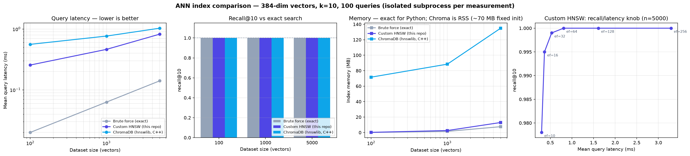

# AI Knowledge & Document Management Platform

A retrieval-augmented Q&A platform over your own documents. Upload PDFs or text,
ask questions, and get answers that are **grounded in retrieved passages, cited
inline, and refused outright when retrieval isn't confident enough to support an
answer**.

Built around a four-stage retrieval pipeline — dense vector search, BM25 keyword
search, weighted fusion, and cross-encoder re-ranking — plus a from-scratch HNSW
index and a measured evaluation of the whole thing.

---

## Table of contents

- [What's interesting here](#whats-interesting-here)
- [Architecture](#architecture)
- [Project layout](#project-layout)
- [Setup](#setup)
- [The retrieval pipeline](#the-retrieval-pipeline)
  - [1. Page-aware chunking](#1-page-aware-chunking)
  - [2. Hybrid search: why BM25 and embeddings both matter](#2-hybrid-search-why-bm25-and-embeddings-both-matter)
  - [3. Cross-encoder re-ranking](#3-cross-encoder-re-ranking)
  - [4. Citations](#4-citations)
  - [5. Low-confidence abstention](#5-low-confidence-abstention)
- [Custom HNSW index](#custom-hnsw-index)
- [Benchmark results](#benchmark-results)
- [Retrieval evaluation](#retrieval-evaluation)
- [API reference](#api-reference)
- [Configuration](#configuration)
- [Limitations](#limitations)

---

## What's interesting here

Most RAG demos are `embed → cosine search → stuff into prompt`. That pipeline
fails in predictable, well-understood ways. This one addresses each failure
explicitly and **measures whether the fix worked**:

| Failure mode | Mitigation | Measured? |
|---|---|---|
| Embeddings can't match exact tokens (`E-4021`, `SEV-1`) | BM25 keyword retrieval fused with vector search | Yes — per-category hit rate |
| Bi-encoder can't tell "on topic" from "answers the question" | Cross-encoder re-ranks the shortlist | Yes — MRR delta |
| Model invents an answer when nothing relevant was retrieved | Abstain below a calibrated confidence threshold | Yes — measured on unanswerable questions |
| "The document says X" with no way to check | Every claim carries a clickable `[n]` → document + page | Yes — cited-vs-retrieved shown in the UI |
| ANN index is an opaque dependency | HNSW implemented from scratch, benchmarked against ChromaDB and exact search | Yes — latency / recall / memory |

---

## Architecture

```
                          ┌──────────────────────────────┐
                          │   frontend/index.html        │
                          │   chat UI · citations ·      │
                          │   confidence · α slider      │
                          └──────────────┬───────────────┘
                                         │ fetch()
                          ┌──────────────▼───────────────┐
                          │        FastAPI (app/main)    │
                          │  /documents/upload  /query   │
                          └───┬──────────────────────┬───┘
                              │                      │
                 INGEST       │                      │      QUERY
       ┌──────────────────────▼────┐   ┌─────────────▼──────────────────┐
       │ document_processor        │   │ retrieval.py                   │
       │  · pypdf text extraction  │   │                                │
       │  · RecursiveCharacter-    │   │   ┌────────────┐ ┌───────────┐ │
       │    TextSplitter           │   │   │  vector    │ │   BM25    │ │
       │  · offset → page mapping  │   │   │  (Chroma)  │ │(rank_bm25)│ │
       └──────────────┬────────────┘   │   └─────┬──────┘ └─────┬─────┘ │
                      │                │         └───────┬──────┘       │
       ┌──────────────▼────────────┐   │         min-max normalize      │
       │ embeddings.py             │   │         α·vec + (1-α)·bm25     │
       │  all-MiniLM-L6-v2 (384d)  │   │                 │              │
       └──────────────┬────────────┘   │       ┌─────────▼──────────┐   │
                      │                │       │ reranker.py        │   │
       ┌──────────────▼────────────┐   │       │ ms-marco cross-enc │   │
       │ vector_store.py (Chroma)  │◄──┼───────┤ → confidence       │   │
       │ + bm25_index.py (rebuilt) │   │       └─────────┬──────────┘   │
       └───────────────────────────┘   └─────────────────┼──────────────┘
                                                         │
                                          ┌──────────────▼──────────────┐
                                          │ rag_service.py              │
                                          │  confidence < threshold?    │
                                          │    ├─ yes → abstain, no LLM │
                                          │    └─ no  → Ollama (local)  │
                                          │            with [n] citing  │
                                          └─────────────────────────────┘
```

**Ingest.** A file is saved, text extracted (`pypdf` for PDFs), split into
overlapping chunks, embedded, and written to ChromaDB with `document_id`,
`filename`, `chunk_index`, and `page` metadata. The BM25 index is then rebuilt
from Chroma — IDF depends on the whole corpus, so adding one document changes
the scores of every existing chunk and there is no correct incremental update.

**Query.** The question goes to both retrievers in parallel. Their scores are
min-max normalized within the candidate set and combined by `alpha`. The top
candidates go to the cross-encoder, which reorders them and produces a
confidence score. Below threshold, the pipeline abstains without calling the
LLM at all. Above it, the numbered excerpts go to a local Ollama model
(`llama3.2:3b` by default) with an instruction to cite every claim.

---

## Project layout

```
ai-doc-platform/
├── backend/
│   ├── app/
│   │   ├── main.py                 FastAPI app, CORS, lifespan (BM25 rebuild)
│   │   ├── config.py               Settings from .env
│   │   ├── schemas.py              Request/response models
│   │   ├── document_processor.py   Extraction + page-aware chunking
│   │   ├── embeddings.py           sentence-transformers bi-encoder
│   │   ├── vector_store.py         ChromaDB persistence
│   │   ├── bm25_index.py           In-memory BM25, rebuilt from Chroma
│   │   ├── reranker.py             Cross-encoder re-ranking + confidence
│   │   ├── retrieval.py            Hybrid fusion pipeline orchestration
│   │   ├── hnsw.py                 From-scratch HNSW + brute-force baseline
│   │   ├── rag_service.py          Prompting, citations, abstention
│   │   └── routers/
│   │       ├── documents.py        Upload / list / delete
│   │       └── query.py            Ask
│   ├── benchmarks/
│   │   ├── benchmark_ann.py        HNSW vs ChromaDB vs brute force
│   │   ├── ann_benchmark.png       Generated chart
│   │   └── ann_benchmark_results.md
│   ├── eval/
│   │   ├── corpus/                 3 synthetic documents
│   │   ├── eval_set.json           35 questions (30 answerable, 5 not)
│   │   ├── run_eval.py             precision@k / recall@k / MRR
│   │   └── eval_results.md         Generated results
│   ├── data/                       uploads/ + chroma/ (gitignored)
│   └── run.py
├── frontend/
│   └── index.html                  Single-file UI, no build step
├── requirements.txt
├── .env.example
└── README.md
```

`app/` splits along failure boundaries: each retrieval stage is a module you can
test, swap, or disable independently. `routers/` stays thin and delegates.

---

## Setup

**Python 3.10–3.13 is required.** Python 3.14 has no PyTorch wheels yet, and
`sentence-transformers` depends on it.

```bash
cd ai-doc-platform

python3.13 -m venv venv           # any 3.10-3.13 interpreter
source venv/bin/activate          # Windows: venv\Scripts\activate
pip install -r requirements.txt

cp .env.example .env              # defaults work as-is; only edit for a
                                   # different Ollama host/model
```

**Generation runs on a local [Ollama](https://ollama.com) model — no API key,
no per-token cost, nothing leaves your machine.**

```bash
brew install ollama                # or download from ollama.com
ollama serve                       # leave running in its own terminal
                                    # (already running if you installed via
                                    # the macOS/Windows app)
ollama pull llama3.2:3b            # ~2 GB, one-time download
```

Run the backend:

```bash
cd backend
python run.py                     # http://localhost:8000 — docs at /docs
```

Open the UI by opening `frontend/index.html` directly in a browser
(`open frontend/index.html` on macOS), or serve it:

```bash
cd frontend && python -m http.server 5500
```

The first query downloads two models from HuggingFace (~90 MB each): the
`all-MiniLM-L6-v2` bi-encoder and the `ms-marco-MiniLM-L-6-v2` cross-encoder.
Subsequent runs use the local cache.

**Reproduce the numbers below:**

```bash
cd backend
python benchmarks/benchmark_ann.py   # ANN comparison (several minutes)
python eval/run_eval.py              # retrieval eval — no LLM call at all
```

> `run_eval.py` **wipes the ChromaDB collection** and re-indexes the eval corpus.
> Point `CHROMA_DIR` at a scratch path if you have documents you want to keep.

---

## The retrieval pipeline

### 1. Page-aware chunking

A citation is only useful if it can name a page. The obvious approach —
chunk each page separately — truncates every chunk at the page boundary and
destroys sentences that straddle two pages.

Instead, pages are concatenated into one string while recording each page's
start offset. The full text is split normally with `add_start_index=True`, and
each chunk's start offset is mapped back to a page with a binary search
(`bisect_right`). Chunks stay semantically clean; every one still knows its page.

### 2. Hybrid search: why BM25 and embeddings both matter

This is the change that most improves real-world retrieval, and the reason is
specific.

**The failure case embeddings cannot fix.** Consider a chunk reading *"Attempting
to reuse a consumed refresh token returns error code E-4021"* and the query
*"what does error E-4021 mean?"*.

`all-MiniLM-L6-v2` tokenizes `E-4021` into subwords with no learned meaning.
Its embedding is nearly identical to `E-4022` or `E-4030` — the model has never
learned to distinguish these tokens because they carry no distributional
semantics. Every "error code" chunk lands at roughly the same cosine distance,
and the correct one is retrieved by luck. **BM25 sees `E-4021` as a term with
document frequency 1**, assigns it very high IDF, and ranks the right chunk
first almost deterministically.

**The failure case BM25 cannot fix.** Query *"can I roll unused vacation into
next year?"* against *"Employees may carry over a maximum of five unused annual
leave days"*. Shared terms: `unused`. BM25 scores this near zero. The embedding
model matches it easily — `vacation`/`annual leave` and `roll over`/`carry over`
are close in vector space.

Neither retriever dominates, so both run and their rankings are fused:

```
score = α · normalized_vector + (1 − α) · normalized_bm25
```

Normalization matters. BM25 scores are unbounded and corpus-dependent (they can
reach 15+); cosine similarities are bounded in [0, 1]. Summing them raw would
let BM25 dominate regardless of `α`. Min-max normalizing **within the candidate
set** makes `α` mean what it claims.

`α` is exposed as a slider in the UI and as an optional `alpha` field on
`/query`, so you can watch the tradeoff move: slide toward BM25 and error-code
lookups snap into place; slide toward semantic and paraphrased questions improve.

A tokenizer detail that matters: the tokenizer keeps hyphenated and underscored
identifiers intact, so `e-4021` stays one high-IDF token instead of splitting
into two common ones.

### 3. Cross-encoder re-ranking

The retrieval embeddings are a **bi-encoder**: query and passage are encoded
separately and compared by cosine distance. That independence is what makes an
index possible — passage vectors are computed once at upload — but it means the
model never sees the query and passage together.

A **cross-encoder** concatenates them into `[CLS] query [SEP] passage [SEP]` and
runs full self-attention across both, so every passage token attends to every
query token. It catches exactly what the bi-encoder misses: negation, pronoun
binding, and passages that are topically on-point but don't actually answer the
question.

The cost is that relevance can no longer be precomputed — scoring N candidates
costs N forward passes. So the cross-encoder never touches the corpus. It only
reorders the ~10 candidates that survive fusion, which is where its accuracy
buys the most per unit of compute.

### 4. Citations

Metadata is carried end to end: `document_id`, `filename`, `page`, and
`chunk_index` travel from chunking → Chroma → retrieval → fusion → re-ranking →
prompt → response.

Excerpts reach the model numbered and labelled:

```
[1] (source: orbital_api_reference.md, page 1)
Access tokens expire after 3600 seconds...
```

The system prompt requires a bracketed citation on every factual claim. The UI
parses `[n]` markers into clickable chips that scroll to and highlight the
matching source card. Sources the model retrieved but **didn't** cite are dimmed
and labelled "not cited" — useful signal about retrieval quality.

### 5. Low-confidence abstention

Two guardrails at different layers:

**Retrieval-level (hard).** If the cross-encoder's confidence in the best chunk
is below `CONFIDENCE_THRESHOLD`, the LLM is never called. A model handed
irrelevant context will still produce a fluent, wrong answer, so the cheapest
and most reliable fix is not to ask — and it saves the tokens too.

**Prompt-level (soft).** When the model *is* called, the citation requirement
makes ungrounded claims structurally awkward to produce, and any that slip
through are visible as uncited text.

The threshold is not a guessed constant — it's calibrated against the measured
confidence separation between answerable and unanswerable questions
([see below](#retrieval-evaluation)).

---

## Custom HNSW index

`app/hnsw.py` implements Hierarchical Navigable Small World
([Malkov & Yashunin, 2016](https://arxiv.org/abs/1603.09320)) from scratch — no
ANN library, only numpy for the distance kernel.

**Structure.** A stack of proximity graphs. Every node lives in layer 0; nodes
are promoted to higher layers with exponentially decaying probability
(`level = ⌊−ln(U) · 1/ln(M)⌋`), so upper layers are sparse and act as long-range
express lanes. A search enters at the top-layer entry point, greedily descends
to the right neighbourhood, then runs a wide beam search on layer 0.

Two routines carry the structure:

- **`_search_layer`** — best-first beam search bounded by `ef`, with a visited
  set, a candidate min-heap, and a result max-heap. `ef` is the recall/latency
  knob.
- **`_select_neighbors_heuristic`** — Algorithm 4 from the paper. When choosing
  which `M` candidates to link to, keep one only if it's closer to the new node
  than to any already-selected neighbour. This is what preserves long-range
  edges; without it the graph collapses into tight clusters and recall falls off
  a cliff.

Degree is capped at `M` on upper layers and `2M` on layer 0 (which holds every
node and needs the extra connectivity). When an insert pushes a neighbour over
its cap, the same heuristic re-prunes it.

---

## Benchmark results

`python benchmarks/benchmark_ann.py` — 384-dim vectors, k=10, 100 queries,
Apple Silicon / Python 3.13. Each measurement runs in an isolated subprocess.



| Dataset | Method | Build (ms) | Query mean (ms) | Query p95 (ms) | recall@10 | Memory (MB) |
|--------:|--------|-----------:|----------------:|---------------:|----------:|------------:|
| 100 | Brute force (exact) | 0.7 | 0.020 | 0.021 | 1.000 | 0.15 |
| 100 | Custom HNSW (this repo) | 308.3 | 0.256 | 0.280 | 1.000 | 0.26 |
| 100 | ChromaDB (hnswlib, C++) | 923.4 | 0.560 | 0.827 | 1.000 | 71.61 ᴿ |
| 1000 | Brute force (exact) | 2.0 | 0.063 | 0.108 | 1.000 | 1.51 |
| 1000 | Custom HNSW (this repo) | 6,982.9 | 0.463 | 0.491 | 1.000 | 2.59 |
| 1000 | ChromaDB (hnswlib, C++) | 907.8 | 0.766 | 0.831 | 1.000 | 88.42 ᴿ |
| 5000 | Brute force (exact) | 3.1 | 0.141 | 0.172 | 1.000 | 7.58 |
| 5000 | Custom HNSW (this repo) | 54,135.7 | 0.824 | 0.900 | 1.000 | 12.98 |
| 5000 | ChromaDB (hnswlib, C++) | 1,867.3 | 1.032 | 1.119 | 1.000 | 134.92 ᴿ |

Memory is counted **exactly** (vectors + graph edges) for the Python indexes.
ᴿ = RSS delta, used only for ChromaDB, whose allocation happens in C++ behind an
opaque API; it includes ~70 MB of fixed client init that does not scale with
dataset size.

### Reading these numbers honestly

**Brute force wins at every size tested, and that is the correct result.** At
5,000 × 384 floats the entire corpus is a 7.6 MB matrix — one cache-friendly
BLAS `matmul` at 0.141 ms. HNSW pays Python interpreter overhead on every graph
hop and loses at 0.824 ms. An ANN index is not free; it trades build time,
memory, and recall for query time, and **that trade does not pay off until the
dataset is large enough that exact search stops fitting comfortably in cache**.
At a few thousand chunks — which is where most document-QA deployments actually
live — brute force is the right engineering choice. This benchmark's most useful
output is knowing that.

**recall@10 is 1.000 everywhere in the main table**, so it is not the
interesting axis at this scale either. The tradeoff only becomes visible when
`ef_search` is swept, which is the real characteristic curve of an HNSW index:

| ef_search | Query mean (ms) | recall@10 |
|----------:|----------------:|----------:|
| 10 | 0.298 | 0.978 |
| 16 | 0.365 | 0.995 |
| 32 | 0.531 | 0.999 |
| 64 | 0.808 | 1.000 |
| 128 | 1.612 | 1.000 |
| 256 | 3.294 | 1.000 |

`ef_search` is the beam width at query time. Recall saturates at 64 while latency
keeps climbing linearly — **`ef=16` gives 99.5% recall for 45% of the latency**,
and past 64 you are paying for nothing. The sweep reuses a single graph (it is a
query-time parameter, so no rebuild is needed), making it a controlled
comparison.

**Build time is where the Python implementation really loses**: 54 s vs
ChromaDB's 1.9 s at n=5000, a ~29× gap. Both run the same algorithm, so this is
an implementation result, not an algorithmic one — the interpreter overhead on
`_search_layer`'s inner loop dominates, and it is exactly what `hnswlib` exists
to avoid.

### Correctness, re-checked beyond the headline number

recall@10 = 1.000 on one synthetic dataset is a weak claim on its own — it
says the algorithm works on data shaped like that dataset, nothing more. Three
follow-up checks, done specifically because that claim needed to be pushed on:

- **The graph algorithm was re-derived line-by-line against Malkov & Yashunin
  (2016)'s Algorithm 2 (`SEARCH-LAYER`) and Algorithm 4
  (`SELECT-NEIGHBORS-HEURISTIC`).** Both match the paper — the frontier/result
  heap bookkeeping, the "closer to the new node than to any already-selected
  neighbour" diversity check, and the `ep ← W` multi-entry-point carry-forward
  between layers during insertion are all correct. The one real defect found
  was trivial: `_random_level()` calls `math.log(random())`, and `random()` can
  return exactly `0.0` (~1-in-2⁵³), which makes `log` return `-inf` and `int()`
  raise `OverflowError`. Fixed with a floor.
- **Exact-duplicate vectors dropped raw-label recall@10 to 0.33** on a
  synthetic test (50 points × 20 exact copies each) — alarming until checked
  further: recall computed on *which of the 50 true points* a result belongs
  to (ignoring which specific duplicate) was **1.0000**. Both HNSW and brute
  force found the right neighborhood every time; they just returned different,
  equally-valid members of a 20-way tie. Not a graph bug — a known sharp edge
  of `recall@k` as a metric under duplicate data, worth knowing about, not
  worth "fixing" in the index.
- **The benchmark dataset is synthetic (deliberately-overlapping Gaussian
  clusters, not naive isotropic noise — see the docstring in
  `benchmark_ann.py`), which still isn't the same geometry as real text
  embeddings.** Checked directly: 1,020 real, non-duplicate sentences across 6
  topics, embedded with the actual `all-MiniLM-L6-v2` production model, held-out
  queries never in the index. **recall@10 = 1.0000**, and nearest-neighbor
  results were topically coherent and genuinely distinct (verified by eye, not
  just by label match) — e.g. five different storm-related sentences at five
  different distances for a held-out weather query. The first attempt at this
  check used sloppily-generated sentences with heavy near-duplication and
  scored 0.90 with tied, identical-text neighbors — the same tie-breaking
  artifact as above, not a real finding, and rerun properly rather than
  reported as-is.

---

## Retrieval evaluation

`python eval/run_eval.py` — 35 questions (30 answerable, 5 deliberately
unanswerable) over a 3-document, 16-chunk corpus. **No LLM call is made**: answer
quality is downstream of retrieval, so if the right chunk never enters the
context window no prompt can recover it. Measuring the retriever alone also
makes the eval free and deterministic.

Ground truth is defined by **evidence phrases**, not hard-coded chunk IDs — a
chunk is relevant if it comes from the labelled document and contains at least
one phrase. Hand-labelled IDs would break the moment `CHUNK_SIZE` changed.

### Retrieval quality

| Configuration | P@1 | R@1 | P@3 | R@3 | P@5 | R@5 | hit@3 | MRR |
|---------------|----:|----:|----:|----:|----:|----:|------:|----:|
| Vector only | 0.767 | 0.733 | 0.322 | 0.900 | 0.207 | 0.950 | 0.933 | 0.859 |
| BM25 only | 0.700 | 0.633 | 0.311 | 0.817 | 0.193 | 0.850 | 0.833 | 0.775 |
| Hybrid (α=0.6) | 0.833 | 0.767 | 0.367 | **0.983** | 0.220 | **0.983** | **1.000** | 0.906 |
| Hybrid + rerank | **0.933** | **0.867** | 0.356 | 0.950 | 0.213 | 0.950 | 0.967 | **0.950** |

> `precision@k` is capped at `k/|relevant|`. With ~1.13 relevant chunks per
> question, P@5 cannot exceed ~0.23 — compare configurations against each other,
> not against 1.0.

Two things to read here:

- **Hybrid beats both of its own components** on every metric. Fusion is not a
  wash; it is a strict improvement over either retriever alone.
- **Re-ranking trades recall for precision.** It lifts P@1 from 0.833 → 0.933
  and MRR to 0.950, while R@3 dips 0.983 → 0.950. That is the expected shape: the
  cross-encoder reorders aggressively, so the best chunk moves to rank 1 more
  often, but an occasional relevant chunk gets pushed out of the top-3. For a
  RAG pipeline that is the right trade — the LLM reads the top chunk first.

### Where each retriever earns its place (hit@3)

| Question type | n | Vector only | BM25 only | Hybrid + rerank |
|---------------|--:|------------:|----------:|----------------:|
| lexical (`E-4021`, `#sec-oncall`) | 8 | 0.750 | **1.000** | **1.000** |
| semantic (paraphrase) | 10 | **1.000** | 0.600 | 0.900 |
| mixed | 12 | **1.000** | 0.917 | **1.000** |

**This is the entire argument for hybrid search, measured.** BM25 is perfect on
exact-token questions where embeddings drop to 0.750; embeddings are perfect on
paraphrase where BM25 collapses to 0.600. Each fails precisely where the other
succeeds, and the fused pipeline holds ≥0.900 across all three.

### Abstention calibration

Neither confidence signal separates answerable from unanswerable on its own:

| | n | cross-encoder mean | median | p10 | cosine mean | cosine max |
|---|--:|-------------------:|-------:|----:|------------:|-----------:|
| Answerable | 30 | 0.626 | 0.977 | 0.000 | 0.461 | — |
| Unanswerable | 5 | 0.030 | — | — | 0.294 | 0.540 |

The cross-encoder's answerable scores are **bimodal — median 0.977 but p10
0.000**. It scores 8 of 10 paraphrased questions near zero despite ranking them
correctly, because `ms-marco` is trained on Bing queries where relevance
correlates with lexical overlap. It is an excellent *ranker* and a badly
calibrated *absolute scorer*. Cosine survives paraphrase but rates
topically-adjacent irrelevant chunks highly — the unanswerable *"What was ACME's
revenue?"* scores 0.540, above most answerable semantic questions.

Because they fail on **different** questions, the shipped gate abstains only when
**both** are weak:

| t_rerank | t_cosine | Catches unanswerable | Wrongly refuses answerable |
|---------:|---------:|---------------------:|---------------------------:|
| 0.15 | **0.30** ✅ | 3/5 (60%) | **4/30 (13%)** |
| 0.15 | rerank only | 5/5 (100%) | 9/30 (30%) |
| 0.20 | rerank only | 5/5 (100%) | 9/30 (30%) |
| 0.30 | rerank only | 5/5 (100%) | 11/30 (37%) |

The single-signal gate catches everything but **refuses 30% of answerable
questions** — unusable. The two-signal gate cuts that to 13% while still
catching the clearest unanswerable cases.

The gate is a cheap pre-filter, not the only guardrail. Questions that pass it
still reach a model instructed to reply *"I don't have enough information"* when
the excerpts don't cover them — a semantic judgement made with full context,
which a scalar threshold cannot make. The threshold exists to avoid paying for
that API call when retrieval clearly found nothing.

> Calibrated on only 5 unanswerable questions — enough to demonstrate the
> single-signal gate is unusable, not enough to fix these thresholds precisely.
> Re-run against your own corpus before relying on them.

### Held-out check — and the honest result

The table above has a methodological problem worth naming precisely, not just
gesturing at: **the threshold was *chosen* by sweeping the same 35-question set
that its catch rate is then reported on.** That's train/test contamination —
it measures whether a search found a point that fits this data, not whether
the point generalizes. The "calibrated on only 5 questions" caveat above was
in the original version of this eval and is true, but it names the wrong
problem (sample size); the deeper one is that the sample was reused for both
fitting and reporting.

The fix isn't a proper train/test split — 5 unanswerable questions is already
too few to split further without both halves becoming statistical noise.
Instead, 10 new unanswerable questions were written *after* the threshold was
fixed, deliberately harder (they reuse in-corpus vocabulary — `"Orbital API"`,
`"E-4021"`, `"ACME Robotics"` — to ask about facts that aren't there, which is
exactly the failure mode that fools cosine similarity), and scored once
against the already-chosen `0.15` / `0.30` operating point with **no further
tuning**:

**1/10 caught (10%)** — down from 3/5 (60%) on the tuning set.

| id | question | rerank | cosine | caught |
|---|---|---:|---:|:---:|
| hold-01 | What is the Orbital API's uptime SLA? | 0.425 | 0.450 | ❌ |
| hold-02 | Who is ACME Robotics' Chief Security Officer? | 0.139 | 0.458 | ❌ |
| hold-03 | How does the E-4021 error compare to a competing API's rate-limit errors? | 0.659 | 0.542 | ❌ |
| hold-04 | When is ACME Robotics' next scheduled security audit? | 0.130 | 0.553 | ❌ |
| hold-05 | Is remote work fully unrestricted for every role at ACME Robotics? | 0.992 | 0.652 | ❌ |
| hold-06 | What's a good recipe for banana bread? | 0.000 | 0.051 | ✅ |
| hold-07 | What minimum TLS version does the webhook signature require? | 0.765 | 0.611 | ❌ |
| hold-08 | What was the incident report number for the E-4021 outage in March? | 0.005 | 0.427 | ❌ |
| hold-09 | How many people work at ACME Robotics? | 0.971 | 0.615 | ❌ |
| hold-10 | What is the Orbital API's pricing model? | 0.078 | 0.509 | ❌ |

The gap is not a fluke of small-n noise in the other direction — it is exactly
the failure mode the calibration table above already describes, just not
tested against it before now: cosine rates *topically-adjacent* content
highly regardless of whether the specific fact is present (`hold-05` scores
0.65 cosine — higher than most genuinely answerable questions — because
"remote work" vocabulary is all over the handbook, even though *this specific
claim* about it isn't). The only held-out question caught (`hold-06`, banana
bread) is also the only one with zero vocabulary overlap with the corpus.
`hold-01` through `hold-10` were constructed to be adversarial in exactly this
way, so 10% is a worst-case number, not a representative one — but it is a
real number from real held-out data, and it says plainly that **this
threshold does not reliably catch unanswerable questions that use in-domain
language.** It still reliably catches questions that are simply off-topic. If
your use case needs the former, this threshold is not calibrated for it yet —
that would take a genuinely larger held-out unanswerable set (dozens, not 10)
before the numbers would mean much quantitatively.

> n=10 is a sanity check on overfitting, not a statistically powered
> generalization estimate. Full per-question data in `eval/eval_results.json`.

---

## API reference

| Method | Path | Description |
|--------|------|-------------|
| `POST` | `/documents/upload` | Upload a PDF/TXT/MD file; chunk, embed, index |
| `GET` | `/documents` | List indexed documents |
| `DELETE` | `/documents/{document_id}` | Remove a document and its chunks |
| `POST` | `/query` | Ask a question |
| `GET` | `/config` | Retrieval defaults (used to initialise the UI) |
| `GET` | `/health` | Health check |

**`POST /query`**

```jsonc
{
  "question": "What does error code E-4021 mean?",
  "top_k": 4,              // optional — chunks sent to the LLM
  "alpha": 0.6,            // optional — 1.0 pure vector, 0.0 pure BM25
  "use_reranker": true,    // optional — disable to compare
  "document_id": null      // optional — restrict to one document
}
```

```jsonc
{
  "answer": "Error E-4021 means the refresh token was already consumed... [1]",
  "abstained": false,
  "sources": [
    {
      "citation": 1,
      "filename": "orbital_api_reference.md",
      "page": 1,
      "chunk_index": 2,
      "text": "...",
      "vector_score": 0.71,   // cosine similarity
      "bm25_score": 12.4,     // raw Okapi score
      "fused_score": 0.93,    // normalized weighted combination
      "rerank_score": 0.97    // cross-encoder confidence
    }
  ],
  "stats": {
    "alpha": 0.6, "reranked": true,
    "confidence": 0.97, "semantic_confidence": 0.71,
    "confidence_threshold": 0.15, "vector_confidence_threshold": 0.3,
    "candidates_vector": 20, "candidates_bm25": 14, "candidates_fused": 27,
    "latency_ms": 84.3
  }
}
```

---

## Configuration

All settings live in `.env` (see `.env.example`).

| Variable | Default | Meaning |
|---|---|---|
| `OLLAMA_URL` | `http://localhost:11434/api/generate` | Local Ollama server. `ollama serve` must be running. |
| `OLLAMA_MODEL` | `llama3.2:3b` | Generation model. Must be pulled first: `ollama pull llama3.2:3b` |
| `EMBEDDING_MODEL` | `all-MiniLM-L6-v2` | Bi-encoder, 384-dim |
| `RERANKER_MODEL` | `cross-encoder/ms-marco-MiniLM-L-6-v2` | Cross-encoder |
| `CHUNK_SIZE` | `1000` | Max characters per chunk |
| `CHUNK_OVERLAP` | `150` | Overlap between adjacent chunks |
| `CANDIDATE_POOL` | `20` | Candidates from **each** retriever before fusion |
| `RERANK_POOL` | `10` | Candidates passed to the cross-encoder |
| `TOP_K` | `4` | Chunks sent to the LLM |
| `HYBRID_ALPHA` | `0.6` | Vector weight; BM25 gets `1 − α` |
| `CONFIDENCE_THRESHOLD` | `0.15` | Cross-encoder arm of the abstention gate |
| `VECTOR_CONFIDENCE_THRESHOLD` | `0.30` | Cosine arm — abstain needs **both** below |
| `MAX_UPLOAD_MB` | `20` | Rejected before chunking/embedding, not after |
| `ALLOWED_ORIGINS` | `*` | CORS origins |

---

## Limitations

- **No authentication.** Anyone who can reach the API can read and delete every
  document. `run.py` binds to `127.0.0.1` for that reason. Add auth before
  exposing it.
- **BM25 is in-process memory.** It's rebuilt from ChromaDB at startup and after
  every mutation. Fine for one process; multiple workers would each hold their
  own copy, and a shared store (Elasticsearch, OpenSearch) is the right answer
  at that point.
- **Full BM25 rebuild on every upload.** Correct, since IDF is corpus-wide, but
  O(corpus) per upload. Fine for thousands of chunks, not for millions.
- **The custom HNSW index is not wired into the request path.** ChromaDB serves
  production queries; `hnsw.py` exists to be studied and benchmarked. Swapping it
  in would mean reimplementing persistence and metadata filtering, which is what
  Chroma is there for.
- **No OCR.** Scanned PDFs with no text layer are rejected at upload with an
  explanatory error.
- **Eval ground truth is weak-labelled** by evidence phrases, which biases
  slightly toward lexical matching. The numbers are meaningful as *relative*
  comparisons between configurations, not as absolute quality scores.
- **Single-turn only.** No conversation history, so follow-ups like "what about
  the second one?" won't resolve.
- **Two input-handling bugs found by live adversarial testing, both fixed and
  re-verified:**
  - `top_k=0` was silently treated as "not provided" and fell back to the
    default (`top_k or settings.top_k` — Python's `or` treats `0` as falsy).
    Confirmed live: a request for 0 chunks returned 4. Fixed to `is None`
    (the correct idiom, already used one line below for `alpha`) and bounded
    `top_k` to `[1, 50]` at the API boundary so invalid values are rejected
    with a 422 before reaching retrieval logic at all, rather than silently
    misbehaving. `top_k=-5` previously returned 11 chunks via `list[:-5]`
    slicing — now also rejected.
  - A `.pdf` upload with a valid extension but corrupt/non-PDF bytes crashed
    with a bare, unhandled `pypdf.errors.PdfReadError` → 500, and — because
    the crash bypassed the router's cleanup path entirely — left an orphaned
    file on disk permanently. Fixed: `PdfReadError` is now caught and
    converted to the same clean 400 path already used for empty documents,
    which also restores the cleanup as a side effect. Verified: re-uploading
    the same malformed file produces a 400 with no new orphan.
- **Prompt injection tested live against the actual model, not assumed safe.**
  Two payloads embedded in uploaded document content (an obvious
  `<<<SYSTEM OVERRIDE>>>` block, and a subtler one phrased as an in-document
  "note to AI assistants") were both retrieved as legitimate excerpts and both
  had zero effect on `llama3.2:3b`'s behavior — it answered from the real
  content and ignored the embedded instructions in both cases. This is a
  measured result on one small model and two payloads, not a general
  guarantee; it is not something this project's prompt structure enforces.
- **Concurrency tested, not assumed.** 5 simultaneous document uploads (fired
  in parallel, not sequentially) were all indexed correctly with no ID
  collisions, and all 5 were independently verifiable afterward via BM25
  keyword search — no corruption from the shared in-memory BM25 rebuild under
  concurrent writers.
- **Local generation is weaker at instruction-following than a hosted model —
  measured, not assumed.** Retrieval quality (the eval above) is unaffected,
  since no LLM call happens during retrieval scoring. Citation compliance in
  the final answer was measured separately, live, against `llama3.2:3b`: the
  first pass (plain rules, no example) got **8/9 (89%)** on a small sample and
  produced one answer with zero `[n]` markers. Adding a one-shot example to
  the system prompt and setting `num_predict=1024` explicitly (previously
  unset, silently deferring to Ollama's own default) brought a full 30-question
  run to **25/26 (96%)** — and the one remaining "miss" turned out not to be a
  miss at all: the model correctly declined to answer per rule 3
  ("I don't have enough information...") and a decline has no facts to cite,
  so the true rate on fact-bearing answers is 25/25. 3B models are not
  perfectly reliable at this; a larger `OLLAMA_MODEL` (`llama3.1:8b`,
  `qwen2.5:14b`) will do better if citation compliance matters more than speed.
- **Factual correctness is a separate, more serious problem than citation
  format, and it is not solved — measured and reduced, not fixed.** Citation
  *format* compliance (above) asks whether a `[n]` marker is present. This asks
  whether the claim attached to it is *true*. Testing "What does error code
  E-4021 mean?" — a table lookup where the correct row (E-4021) sits directly
  next to a near-identical one (E-4011), one digit apart — found `llama3.2:3b`
  attributing E-4011's definition to E-4021 **7 out of 8 times**, confidently,
  in properly-formatted answers with a citation marker attached to the wrong
  claim. The correct source chunk was retrieved every single time, at 0.977
  cross-encoder confidence — this is a pure generation failure, not a
  retrieval failure, and it is exactly the failure mode the whole citation
  system exists to let a user catch — except a user without the source open
  next to them has no way to catch it, because the answer looks identical in
  format whether it's right or wrong.

  Two interventions were tried and both are now in the code, but neither
  "fixes" this in the sense of eliminating it:
  - `temperature=0.1` was tried first, on the theory that lower temperature
    reduces hallucination. **It made this specific failure worse** — 8/8 wrong
    at 0.1, with every run producing the exact same incorrect sentence
    verbatim, versus 7/8 wrong at Ollama's default (~0.8). The wrong answer is
    apparently the model's single highest-probability completion for this
    input; lowering temperature narrows sampling toward that peak instead of
    occasionally escaping it. Reverted for this reason — a plausible fix that
    measurably backfired, kept only because it was tested, not assumed.
  - A sixth system-prompt rule was added instead, targeted at the specific
    mechanism observed (adjacent-row confusion in a table), instructing the
    model to locate the exact matching row before answering. Re-tested at
    8 runs: **3/8 wrong (37.5%)**, down from 7/8 (87.5%) — a real, measured
    ~2.3x improvement, and the one kept. It is still wrong more than one time
    in three on this question.

  This is the honest ceiling of prompt-only mitigation on a 3B model, not a
  bug with a code fix. If this class of error is unacceptable for your use
  case — and for anything where a wrong answer has real consequences, it
  should be — the actual fix is a larger model (`OLLAMA_MODEL=llama3.1:8b` or
  larger) or a hosted API, not further prompt tuning against one adversarial
  example. Re-run the eight-sample check in
  [Retrieval evaluation](#retrieval-evaluation)'s methodology against whatever
  model you configure before trusting it with anything that matters.
- **Local generation latency varies widely and is not fast.** Measured on this
  machine (Apple Silicon, GPU-accelerated Ollama): first call after Ollama
  starts pays a one-time model-load cost of **~48s**; warm calls range
  **~7-43s** depending on answer length, with no p50/p95 characterization
  attempted — this is a personal-project observation, not a benchmark. A single
  truncated/incomplete response was observed once in ~40 live test queries and
  did **not** reproduce across 8 direct repeats of the identical prompt, all of
  which returned `done_reason: stop` (Ollama's own "completed normally"
  signal) — likely a transient hiccup (possibly a model-unload race), not a
  deterministic bug in this code. Flagged rather than hidden: an unexplained
  one-off is not the same as a fix.
- **No upload size limit — found and fixed during testing, not designed in.**
  A 34MB upload with no cap took **58 minutes** to embed (42,857 chunks) and
  then still failed, because ChromaDB rejects a single write batch above its
  own internal limit (5,461, observed on this version). Fixed two ways:
  `MAX_UPLOAD_MB` (default 20) now rejects an oversized file in milliseconds,
  before any chunking or embedding runs; and `add_chunks()` now batches its
  ChromaDB writes, verified live with a 10,000-chunk document (still under the
  20MB cap) that previously would have hit the same batch-size crash
  regardless of the size limit. Neither fix alone was sufficient — a maximal
  20MB upload can still produce more chunks than Chroma's batch cap.
